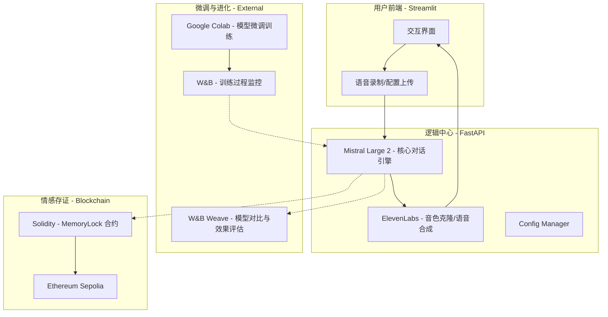

# 🎙️ BeWithMe - AI 情感陪伴与记忆永续系统

**基于 Mistral Large 2、ElevenLabs 与区块链的情感资产数字化平台**

在 [NVIDIA Mistral 全球黑客松 2026](https://worldwide-hackathon.mistral.ai/) 中，BeWithMe 致力于通过 AI 与 Web3 技术，让您可以与思念的亲人进行富有情感的对话，并确保这些珍贵记忆的永恒与权属。

---

## 📺 项目演示 (Demo)
> [!TIP]
> **演示视频入口**：[点击查看演示视频](#) (即将上线)  
> **核心 UI 展示**：[查看截图库](docs/screenshots/) (包含手机通话、W&B 监控等)

---

## 📖 项目简介：BeWithMe 是做什么的？

**BeWithMe** 是一个全栈 AI 情感陪伴系统，旨在利用现代 AI 技术“复刻”亲人的数字形象。它不仅是一个聊天机器人，而是一个集成了**声音、人格、记忆与权属**的闭环系统。

*   **核心痛点**：解决人们对逝去或远方亲人的思念，通过技术手段实现“数字永生”。
*   **三大阶段**：
    1.  **复刻 (Replication)**：通过 30 秒音频克隆音色，通过性格描述建模人格。
    2.  **进化 (Evolution)**：利用 **Google Colab** 强大的算力对 Mistral 模型进行 Fine-tuning，让灵魂更真实。
    3.  **永续 (Persistence)**：利用区块链进行存证，确保情感数据不因服务商关闭而丢失。

---

## 🏗️ 系统架构图



---

## 🛠️ 技术栈 (Tech Stack)

| 模块 | 技术选型 | 作用 |
| :--- | :--- | :--- |
| **LLM (大脑)** | **Mistral Large 2** | 核心对话引擎，负责逻辑生成与情感理解 |
| **音色克隆 (嗓音)** | **ElevenLabs API** | 30秒快速克隆，生成极具还原度的语音回复 |
| **微调算力** | **Google Colab** | 提供强大的 GPU 算力进行模型 Fine-tuning |
| **微调监控** | **W&B (Weights & Biases)** | 实时监控微调实验过程中的各项指标 |
| **效果评估** | **W&B Weave** | 用于多版本模型的效果对比与性能评估 |
| **后端框架** | **FastAPI** | 高性能异步 Python 框架，处理所有核心业务流 |
| **前端 UI** | **Streamlit** | 响应式 Web 界面，提供沉浸式交互体验 |
| **存证 (权属)** | **Solidity + Sepolia** | 智能合约管理 IPFS 哈希，实现情感资产确权 |

---

## ✨ 核心亮点

### 1. 深度微调与 W&B 实验对比 (Fine-Tuning & Eval)
我们利用 **Google Colab** 对 Mistral 模型进行深度微调。通过 **W&B** 实时监控训练指标，并使用 **W&B Weave** 进行多维度评估：
- **Latency (延迟)**：优化响应速度，实现实时通话体验。
- **Empathy (共情度)**：评估 AI 回复是否具备情感慰藉能力。
- **Human Likeness (拟人度)**：确保口吻、语速与特定亲人高度一致。


### 2. 区块链存证 (MemoryLock)
利用区块链解决“情感资产确权”问题。将素材哈希与模型权重锚定在 **Sepolia** 测试网上，实现：
- **数字所有权**：只有持有特定私钥的家属才能“唤醒”特定的 AI 形象。
- **永续存储**：去中心化存证，记忆不再依赖单一服务商。

### 3. 伦理与安全 (Ethics & Safety) 🛡️
- **身份验证**：系统集成亲属关系声明环节，防止音色克隆技术滥用。
- **数据隐私**：所有敏感音频仅用于模型训练，确保用户隐私。
- **心理导向**：AI 在对话中提供适时的心理慰藉与温馨提示。

---

## 🌈 未来愿景 (Vision)
- **多模态记忆**：从语音交互扩展到数字人 (Digital Human) 与 VR 沉浸式场景。
- **数字遗产 DAO**：建立去中心化自治组织，共同维护家族的数字资产与记忆资产。
- **跨时空对话**：让智慧与爱跨越时空，成为家族传承的一部分。

---

## 🚀 快速开始

### 启动应用
```bash
chmod +x scripts/run_all.sh
./scripts/run_all.sh
```
启动后访问：
- 🎨 **前端 UI**: `http://localhost:8501`
- 🔧 **API 文档**: `http://localhost:8000/docs`

---
🏆 **Hackathon Judges**: 详细评审路径请参考 [DEMO_GUIDE.md](docs/DEMO_GUIDE.md)
