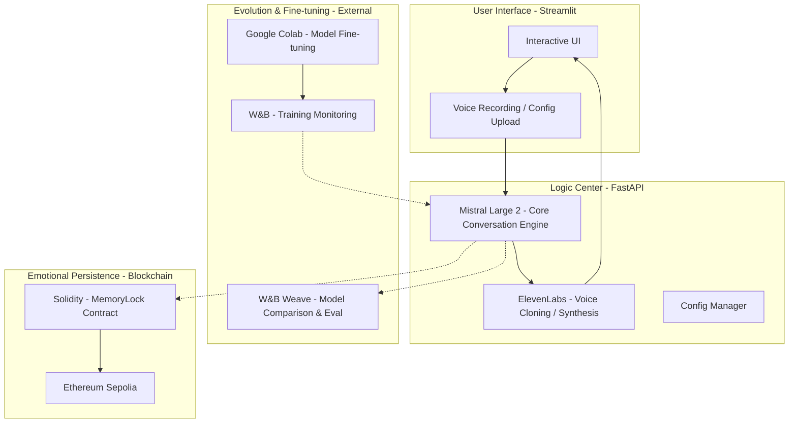
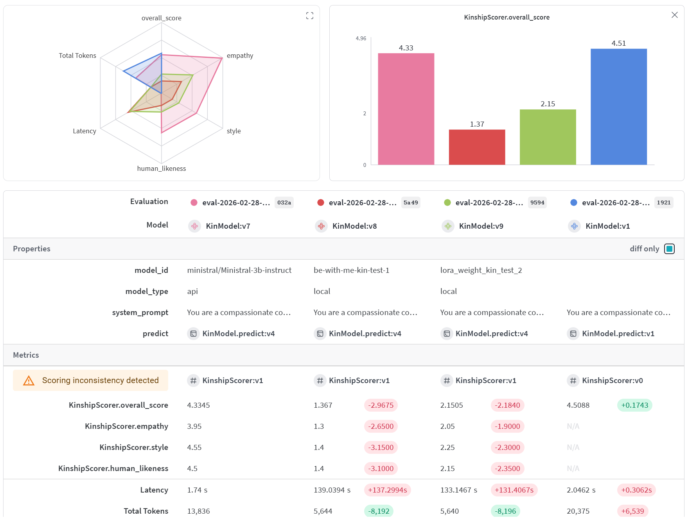

# 🎙️ BeWithMe - AI Emotional Companion & Memory Persistence System

**Digital Platform for Emotional Assets Powered by Mistral Large 2, ElevenLabs & Blockchain**

Built for the [NVIDIA Mistral Worldwide Hackathon 2026](https://worldwide-hackathon.mistral.ai/). BeWithMe is dedicated to creating meaningful conversations with loved ones through AI & Web3, ensuring these precious memories are eternal and owned by you.

---

## � Demo
> [!TIP]
> **Demo Video**: [Watch Demo Video](#) (Coming Soon)  
> **Core UI Showcase**: [View Screenshot Gallery](docs/screenshots/) (Includes Call UI, W&B Dashboard, etc.)

---

## �📖 Project Intro: What is BeWithMe?

**BeWithMe** is a full-stack AI emotional companion system designed to "replicate" the digital persona of loved ones. It's more than just a chatbot; it's a closed-loop system integrating **voice, personality, memory, and ownership**.

*   **Core Pain Point**: Addressing the longing for lost or distant loved ones by achieving "Digital Immortality" through technology.
*   **Three Key Stages**:
    1.  **Replication**: 30-second voice cloning and personality modeling via character descriptions.
    2.  **Evolution**: Fine-tuning Mistral models using **Google Colab's** powerful compute to make the "soul" more authentic.
    3.  **Persistence**: Leveraging blockchain for decentralized storage, ensuring emotional data survives beyond any single service provider.

---

## 🏗️ System Architecture



---

## 🛠️ Tech Stack

| Module | Technology | Role |
| :--- | :--- | :--- |
| **LLM (Brain)** | **Mistral Large 2** | Core conversation engine for empathy and logic |
| **Voice (Voice)** | **ElevenLabs API** | 30s instant cloning for high-fidelity voice replies |
| **Compute** | **Google Colab** | High-performance GPU power for Model Fine-tuning |
| **Monitoring** | **W&B (Weights & Biases)** | Real-time tracking of fine-tuning metrics |
| **Evaluation** | **W&B Weave** | Comparison of model versions and performance evaluation |
| **Backend** | **FastAPI** | High-performance async Python framework for business flow |
| **Frontend** | **Streamlit** | Responsive Web UI for an immersive user experience |
| **Web3 (Ownership)** | **Solidity + Sepolia** | Smart contracts managing IPFS hashes for asset ownership |

---

## ✨ Core Highlights

### 1. Deep Fine-Tuning & W&B Evaluation (Fine-Tuning & Eval)
We leverage **Google Colab** for deep fine-tuning of Mistral models. Metrics are monitored via **W&B**, and we use **W&B Weave** for multi-dimensional evaluation:
- **Latency**: Optimizing response speed for real-time call experiences.
- **Empathy**: Evaluating the AI's ability to provide emotional comfort.
- **Human Likeness**: Ensuring tone and pace match the specific loved one.



### 2. Blockchain Persistence (MemoryLock)
Solving the "Ownership of Emotional Assets" problem via blockchain. By anchoring material hashes and model weights on **Sepolia**:
- **Digital Ownership**: Only family members with specific private keys can "awaken" the persona.
- **Eternal Storage**: Decentralized persistence ensures memories aren't tied to a single provider.

### 3. Ethics & Safety 🛡️
- **Verification**: Integrated kinship verification to prevent misuse of voice cloning technology.
- **Data Privacy**: Sensitive audio is used strictly for model training with user consent.
- **Psychological Guidance**: AI provides timely emotional support and reminders within conversations.

---

## 🌈 Future Vision
- **Multimodal Memories**: Expanding from voice to Digital Humans and immersive VR environments.
- **Digital Legacy DAO**: Establishing decentralized organizations to maintain a family's digital assets.
- **Cross-Era Dialogues**: Allowing wisdom and love to transcend time as a part of family heritage.

---

## 🚀 Quick Start

### Launch Application
```bash
chmod +x scripts/run_all.sh
./scripts/run_all.sh
```
Access points:
- 🎨 **Frontend UI**: `http://localhost:8501`
- 🔧 **API Docs**: `http://localhost:8000/docs`

---
🏆 **Hackathon Judges**: See [DEMO_GUIDE.md](docs/DEMO_GUIDE.md) for the evaluation walkthrough.
